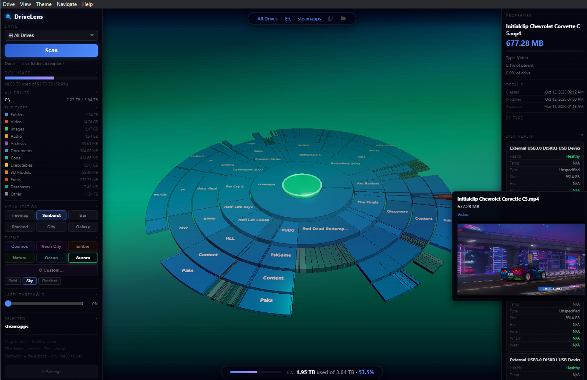

# DriveLens3D

**DriveLens3D** is a Windows desktop app that turns disk usage analysis into an interactive 3D experience. Explore your drives through six visualization modes powered by Three.js, with real-time scanning, S.M.A.R.T. diagnostics, and built-in file management to quickly answer the question: “Where did all my free space go?”



---

## Features

### Visualization Modes
| Mode | Description |
|------|-------------|
| **3D Treemap** | Squarified treemap with height-proportional boxes |
| **Sunburst** | Concentric ring chart with kick-out hover effect |
| **Bar Chart** | Horizontal bars sorted by size |
| **Stacked** | Vertical stacked bars with file-type color breakdown |
| **City** | 3D city skyline — folders become buildings |
| **Galaxy** | Solar system layout — folders as planets orbiting a central sun |

### Themes
- **Cosmos** — Deep space blue
- **Neon City** — Cyberpunk purple/magenta
- **Ember** — Warm fire orange/red
- **Nature** — Forest green
- **Ocean** — Deep sea teal/cyan
- **Aurora** — Northern lights green/purple

### File Management
Right-click any item in the visualization for:
- **Rename** — In-place rename with path rewrite
- **Delete** — Send to Recycle Bin (reversible)
- **Copy / Cut** — Place on Windows clipboard for paste in Explorer
- **Properties** — Opens Windows file properties dialog

### Diagnostics
- **S.M.A.R.T.** — Physical disk health, temperature, power-on hours, read/write errors, wear level, and latency (requires Administrator)
- **Disk Usage HUD** — Always-visible bottom bar showing used/total/percentage

### Navigation
- Drill into folders by clicking
- Breadcrumb trail for quick navigation
- Copy path to clipboard with one click
- Open current folder in Windows Explorer

---

## Installation

### Prerequisites
- Windows 10 or later
- [Node.js](https://nodejs.org/) (v18+)
- [Git](https://git-scm.com/)

### Steps

```bash
git clone https://github.com/yourusername/drivelens.git
cd drivelens
npm install
npm start
```

---

## Usage

1. **Launch** — The app automatically scans all drives on startup
2. **Select Drive** — Use the dropdown or Drive menu to choose a specific drive
3. **Scan** — Click "Scan" to perform a full directory scan
4. **Explore** — Click folders to drill in; press `Esc` to go back
5. **Visualize** — Switch modes with the Visualization buttons
6. **Theme** — Choose a color theme from the Theme section
7. **Settings** — Click ⚙ Settings to configure defaults

---

## Keyboard Shortcuts

| Key | Action |
|-----|--------|
| `Esc` | Go up one level |
| `Home` | Go to root |
| `W` / `↑` | Walk forward (City mode) |
| `S` / `↓` | Walk backward (City mode) |
| `A` / `←` | Walk left (City mode) |
| `D` / `→` | Walk right (City mode) |
| Right-click | Open file context menu |

---

## Mapped Network Drives

DriveLens detects mapped network drives automatically via `Win32_LogicalDisk`. Ensure the network drive is connected before launching or clicking Scan.

---

## S.M.A.R.T. Diagnostics

S.M.A.R.T. data is retrieved via `Get-PhysicalDisk` and `Get-StorageReliabilityCounter` (Windows Storage module). For full access, **run as Administrator**.

Right-click a drive in the **All Drives** visualization → **S.M.A.R.T. Diagnostics**.

---

## Settings

Access via the ⚙ Settings button (bottom of sidebar) or **Help → Settings** in the menu bar.

| Setting | Description |
|---------|-------------|
| Default Mode | Visualization mode on startup |
| Default Theme | Color theme on startup |
| Show Free Space Tiles | Toggle free space display in visualizations |
| Label Threshold | Minimum % to show a label (lower = more labels) |
| Animation Speed | Speed of galaxy particle animations |

Settings are saved automatically to `localStorage`.

---

## Architecture

```
drivelens/
├── main.js          # Electron main process (IPC handlers, menu, file ops)
├── preload.js       # Context bridge (secure IPC bridge)
├── scanner.js       # Recursive file system scanner
├── renderer/
│   ├── index.html   # App shell with sidebar, HUD, modals
│   └── renderer.js  # Three.js visualizations + UI logic
├── assets/
│   └── icon.png     # App icon
└── package.json
```

### IPC Channels
| Channel | Direction | Description |
|---------|-----------|-------------|
| `scan-drive` | renderer→main | Start full directory scan |
| `list-drives` | renderer→main | Get all local + network drives |
| `list-fonts` | renderer→main | Enumerate system fonts |
| `scan-progress` | main→renderer | Progress updates during scan |
| `open-in-explorer` | renderer→main | Open path in Windows Explorer |
| `fs-rename` | renderer→main | Rename file/folder |
| `fs-delete` | renderer→main | Move to Recycle Bin |
| `fs-copy` | renderer→main | Copy to clipboard (CF_HDROP) |
| `fs-cut` | renderer→main | Cut to clipboard (CF_HDROP + DROPEFFECT_MOVE) |
| `fs-properties` | renderer→main | Open Windows Properties dialog |
| `fs-smart` | renderer→main | Read S.M.A.R.T. diagnostics |
| `menu-*` | main→renderer | Menu bar actions |

---

## Building for Distribution

```bash
npm install --save-dev electron-builder
```

Add to `package.json`:
```json
{
  "build": {
    "appId": "com.drivelens.app",
    "productName": "DriveLens",
    "win": {
      "target": "nsis",
      "icon": "assets/icon.png"
    }
  },
  "scripts": {
    "dist": "electron-builder"
  }
}
```

Then run:
```bash
npm run dist
```

---

## License

MIT License — see [LICENSE](LICENSE) for details.

---

## Contributing

Pull requests welcome! Please open an issue first to discuss major changes.
